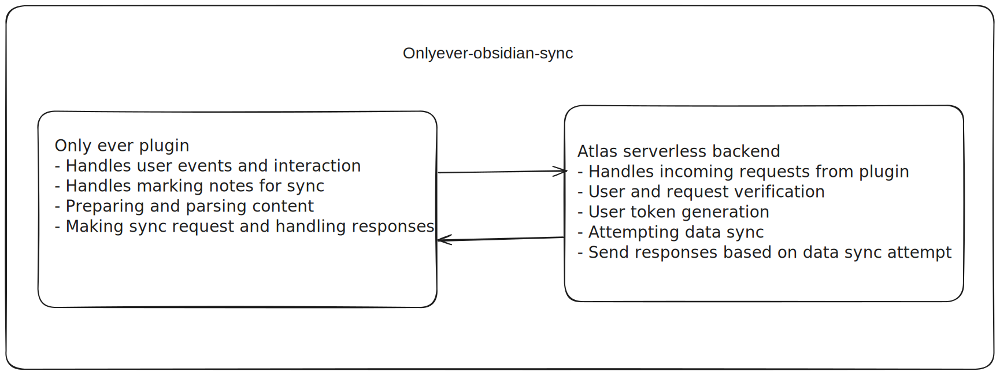
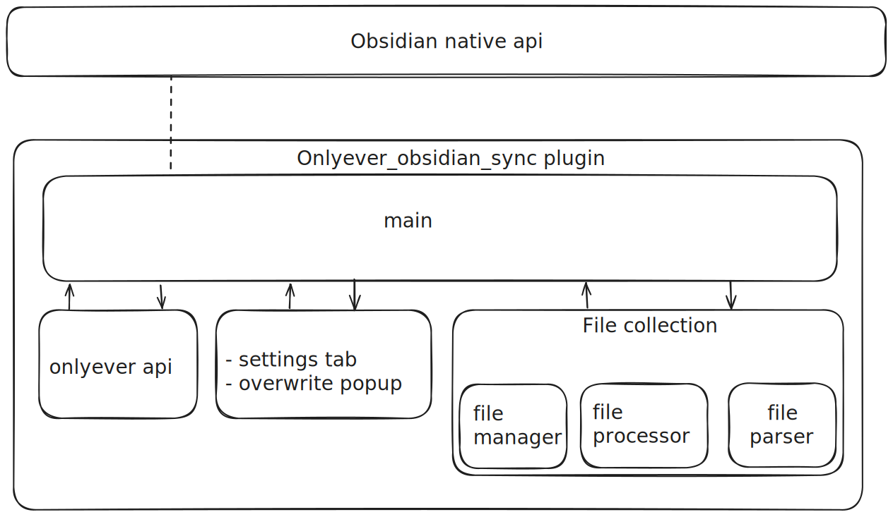
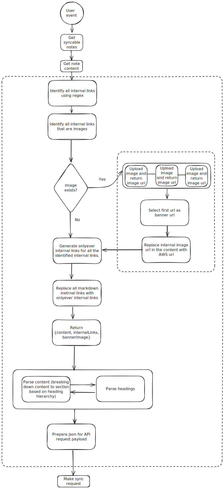
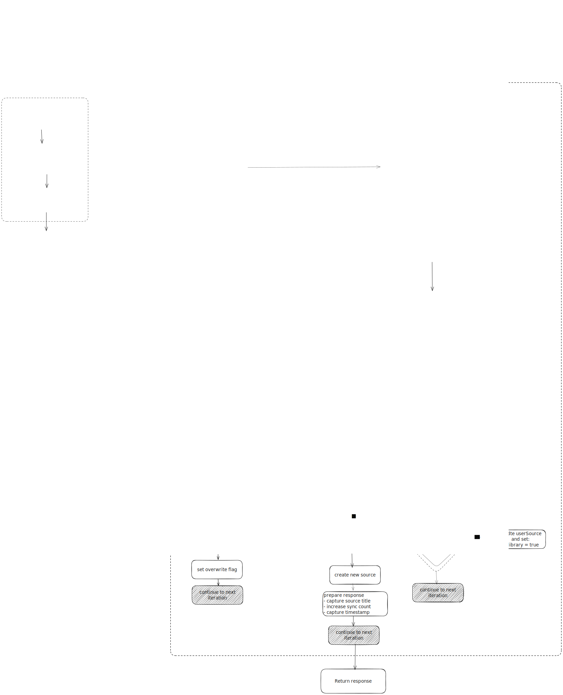

# Preface

⚠️: This document is underconstruction and is subject to change.

💬: 
This document is designed to offer fundamental insights into the workings of the system. We've crafted the documentation with simplicity in mind, ensuring that individuals with non-technical backgrounds can grasp the essence of the system. This is why, some technical terminologies are loosely used. While this approach facilitates understanding for beginners, individuals with technical expertise may find that certain details are presented in a simplified manner that diverges from precise technical terminology and the norm.  

## Terminologies
- **👨‍💼 COLLABORATORS:** Non devlopers associates and maintainers of this project. Can skip reading `For DEVS` sections. 
- **👨‍💻 DEVS:** Developers that have access to the code base and require to know details, please read the entire document including `For COLLABORATORS` sections.

## How to read this document
- Each topic if necessary starts with a image of the procedure being described. 
- **👨‍💼 For COLLABORATORS: ** we recommend using the image and the summary below (if exists) the to understand the topic. 
- **👨‍💻 For DEVS:** all classes and methods will be documented as necessary. All classes and methods in this document will be embeded links that redirect to the documentation of said module.

---

# System Breakdown

## High level diagram
The concept behind syncing data is very simple. Given that an Onlyever app user uses the Obsidian plugin, the plugin creates source document/object for every new note that he/she syncs from the plugin and update the source object incase theres updates to the notes.

## Plugin modules
This topic deals with breaking down the internals of the plugin on a abstract level. 

### 👨‍💼 For COLLABORATORS
- **main** : This is the entry point of our plugin. This module is acts as an interface for our code and the obsidian ecosystem(native API). This module handles the plugin lifecycle, event listening and handling, loading other modules, etc. 
- **onlyever api** : This module contains code that is responsible for communicating with Atlas serverless functions. 
- **settings tab** : This module contains code that registers features to the setting tab of onlyever_obsidian_sync plugin. 
- **overwrite popup** : This module contains code that shows overwrite popup when an overwrite condtion is met. 
- **file collection** : This is a module contains the following submodules with their own responsibilities:
    - **file manager**: Uses Obsidaian native API to access the vault and the files within the vault.
    - **file processor**: Parent to file parser. Validates and provides required notes for file parser to parse.
    - **file parser**: Performs all necessary parsing needed to create a valid payload for onlyever api module to use. 

### 👨‍💻 For DEVS
- Check out [Documentation of Main](core/main.rmd).
- Check out [Documentation of File manager](core/file-manager).
- Check out [Documentation of File processor](core/file-processor).
- Check out [Documentation of File parser](core/file-parser).
- Check out [Documentation of Onlyever API](core/file-onlyever-api).
- Check out [Documentation of Settings tab](core/file-settings-tab).
- Check out [Documentation of Overwrite modal](core/file-overwrite-modal).

---

## Plugin sync mechanism

Heres the general flow of how a marked file is treated. When a valid event is fired. Respective functions are called. The flow of all the functions are relatively same, the only thing that is different is how many files are affected by the event.  

### 👨‍💼 For COLLABORATORS
<ol>
  <li>Get note content.</li>
  <li>
  Identify all markdown internal links,  links to other notes.(Syntax: `[[Other-markdown-note]]`) and remote URLs of Wikipedia and YouTube (Syntax: `[Alias](url)`).
  </li>
  <li>
    Identify all embedded images with the syntax `![[Image name]]`.
  </li>
  <li>For all identified images:
    <ul>
      <li>Upload them to an AWS S3 bucket.</li>
      <li>Capture the generated URL.</li>
    </ul>
  </li>
  <li>
  Replace all instances of identified images syntax with the new syntax: `` in the content.
  </li>
  <li>Parse the content to convert all markdown internal links to Onlyever internal links. ( Syntax: `[[alias|title|slug|index]]` )
  </li>
  <li>The above steps (5 and 6) generate other necessary attributes needed for making a sync request like: `banner_image`, `internal_links`, `headings`, `contents`, etc.
  </li>
  <li>Parse content to JSON as required in the request.</li>
  <li>Make sync request.</li>
</ol>
Read more about [events and functions]().

### 👨‍💻 For DEVS

---

## Atlas sync mechanism
Heres a breakdown of the 'syncNotes' function in Atlas app services.

### 👨‍💼 For COLLABORATORS

### 👨‍💻 For DEVS

